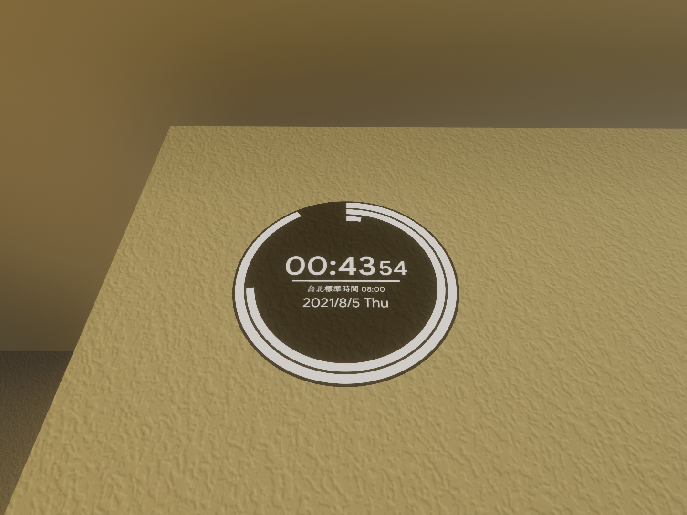

[繁體中文](#zht)
[日本語](#jpn)
[English](#eng)

## 時鐘
時間/時區使用的是電腦上的

### 需求
* VRCSDK3 2021.07.12.18.53 或以上
* UdonSharp v0.20.0 或以上

### 安裝
1. 導入 [VRCSDK](https://vrchat.com/home/download) 到你的專案裡
2. 導入 [UdonSharp](https://github.com/MerlinVR/UdonSharp) 到你的專案裡
3. 拖曳 Clock 到你的場景裡並重新調整大小、位置、選轉成你要的樣子
4. 如果你想要用12小時制的話，取消勾選「24小時制」選取框

### 下載
這裡
不用標記作者沒關係
但要是能標記一下的話我會很開心的 :D

## VRChat想定時計
時間とタイムゾーンはそれぞれのパソコンに表示される時刻と同期されます

### 必須Assets
* VRCSDK3 (2021.07.12.18.53 以上)
* UdonSharp (v0.20.0 以上)

### 導入方法
1. [VRCSDK](https://vrchat.com/home/download) をUnityへインポートしてください。
2. [UdonSharp](https://github.com/MerlinVR/UdonSharp) をUnityへインポートしてください。.
3. フォルダにある「Clock」プレハブをワールドの任意の場所に配置してください。(大きさも変更可能です)
4. 「24時間制」のチェックを外すと、24時間制から12時間制に変更することができます。

### ダウンロード
ここ

## Digital Clock
Using system time, same as timezone name.

### Requirements
* VRCSDK3 2021.07.12.18.53 or later.
* UdonSharp v0.20.0 or later.

### Installation
1. Import [VRCSDK](https://vrchat.com/home/download) into your project.
2. Import [UdonSharp](https://github.com/MerlinVR/UdonSharp) into your project.
3. Drag the Clock prefab into your scene, and retransform as you want.
4. Uncheck the "24-hour clock" checkboox if you wish to use 12-hour clock instead of 24.

### Download
here
You don't need to credit me in your world, but if you do, I appreciate it. :D

